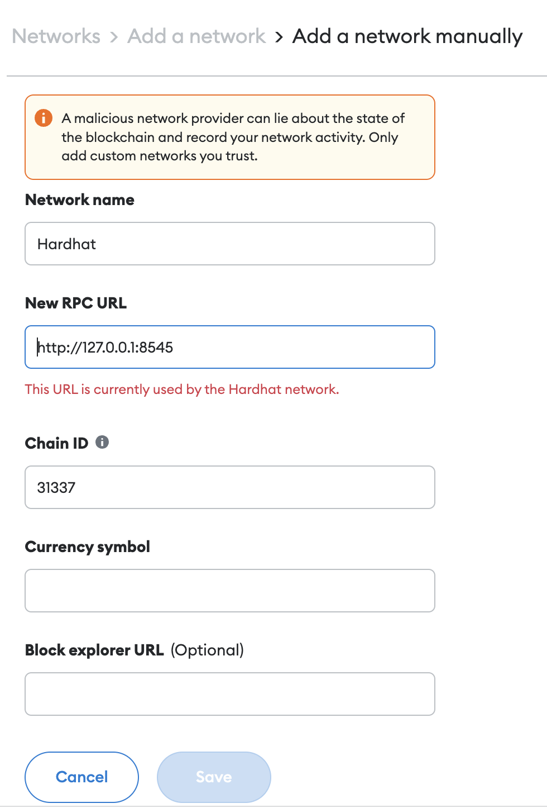

# CZ4153 Project: Dutch Auction

> By Team Satoshi
> Group members: Gordon Tan, Hoo Jia Kai, Tan Yap Siang

## Table of Contents

- General Info
- Technologies Used
- Setup
- File structure and organization
- Flow
- Dutch Auction Mechanism
- Satoshi Dutch Auction Smart Contract Design
- Features

## 1. General Information

- This project is a web application that allows one to create auctions for ERC20 tokens based on user customization, bid for auctioned tokens and be assigned tokens based on the dutch auction.

## 2. Technologies Used

- Frontend: ReactJS and ethers library to connect and interact with blockchain
- Backend: Solidity for smart contract development
- Environment: Hardhat testing framework and hardwork network to simulate actual Ethereum network

## 3. Setup

### Basic Requirements:

1. node v18.0
2. **Metamask extension** installed on browser

### For running web application

1. npm install : to install required dependencies to run project
2. npx hardhat node : to setup hardhat server, connect to network and initialise user accounts for local deployment
3. npm start: to run web application

### For running test scripts

1. npx hardhat test: to run tests against smart contract code
2. npx hardhat test reentrancy/ReentrancyTest.js: to run test cases for reentrancy attacks

### Network and Account Setup

     
     

1. From metamask extension, click add network

2. Key in **network name, rpc url and chainId** as shown in attached picture

 

3. Click on account profile and select import accounts

4. Key in **private key** of accounts shown in npx hardhat node log to import accounts (import at least two accounts for testing purposes)

## 4. File structure and organization

Listed below are the main folders that contain our web application code

- contracts folder: contains smart contracts solidity files used for the project
- src folder: App.js and components folder contain web application code
- test folder: contains test scripts used for the respective contracts

## 5. Workflow

For this assignment, we will have an Owner who will be deploying all of our contracts. He will be paying for all the operations and contract calls required for the dutch auction operate.

Any user can create an auction while keying the token details before deploying it at a designated time. Auction will begin at the specified time and any user can enter and place a bid at the prevailing price. Auction will end in 20 minutes or when all tokens are sold out. After the token ends, bidders have to withdraw their allocated tokens. For bids that are rejected or partially fulfilled, a refund will be given back to the bidders. Allocation of tokens and refunds are determined by the principles of dutch auction and can only be computed when the auction ends.

## 6. Dutch Auction Mechanism

Our dutch auction is similar to the mechanism behind Algorand's token bidding system. In the beginning, users will indicate the start date time, starting price, discount rate per minute and minimum bid price. At every minute, the price of tokens will be updated based on the discount rate. The tokens assigned to each user will also be adjusted based on the current price. In all cases, we will assign tokens in a first come first serve order and auction ends once all tokens are allocated at any given price or when 20 minutes is up. If there are any leftover tokens, they will all be burned.

## 7. Satoshi Dutch Auction Smart Contract Design

In our dutch auction web application, we have an auction factory that creates auctions. Each auction has their own ERC20 token and can perform their own operations.

## 8. Features

### 8.1 Viewing all auctions

- Able to show all existing auctions by status; happening now, happening soon, ended

### 8.2 Creating an auction

     
     

- User will input their token name, symbol, token supply, initial price, discount rate per second and minimum bid with validators in place

### 8.3 Placing a bid

- User will input their bid amount and click place bid

- User will need to approve transaction before being able to place a bid

- After placing bid, the bid log will reflect bids that are placed by all users.

 

- Note: Sometimes metamask produces this error. To rectify this, please go to account settings and click reset account before trying again

### 8.4 Withdrawing tokens

 

- After the auction ends, User will click withdraw and pay for withdrawal transaction.
- Allocated tokens and refunded amount will be awarded after transaction is made.

 

- To be able to see allocated tokens in your metamask extension, you have to first import tokens. After which, you have to input the token address which is listed in the auction.
